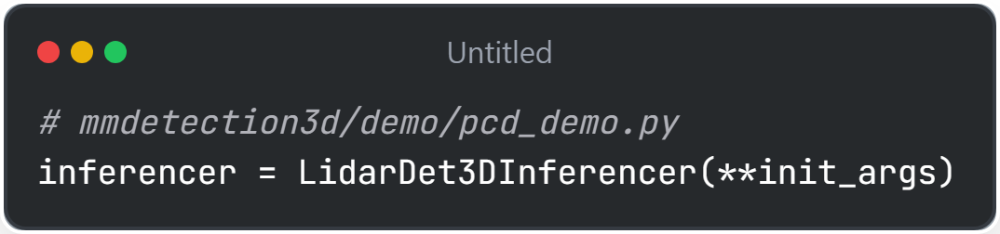
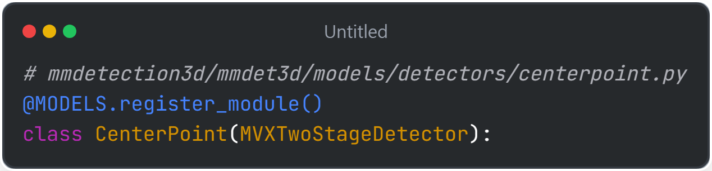
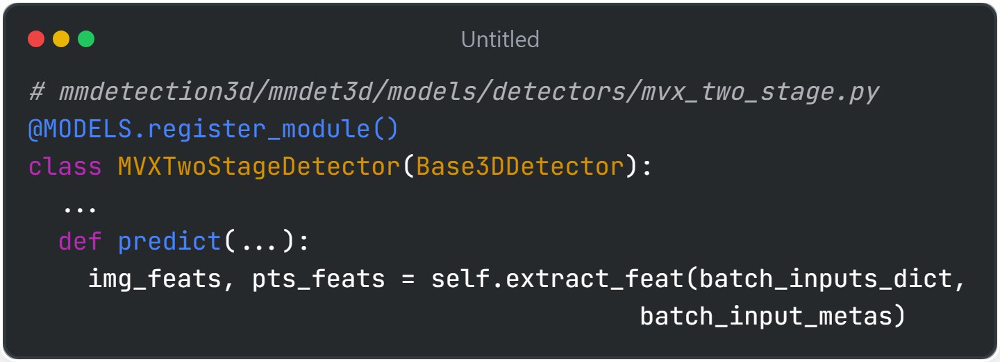
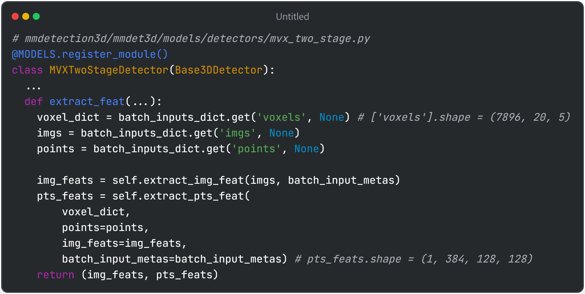
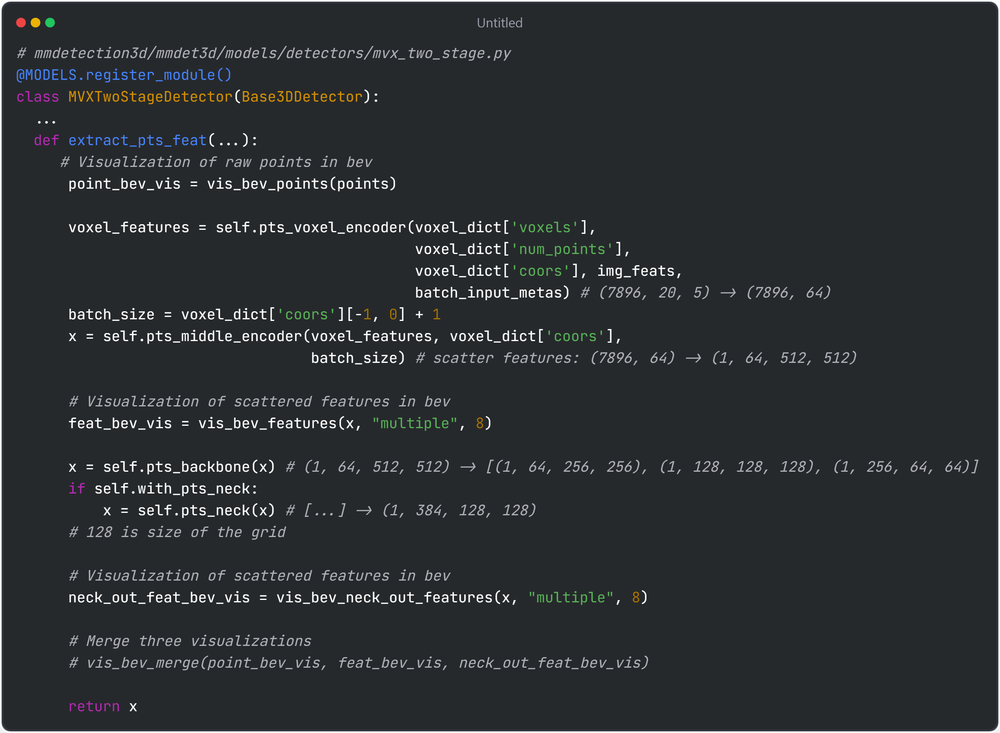
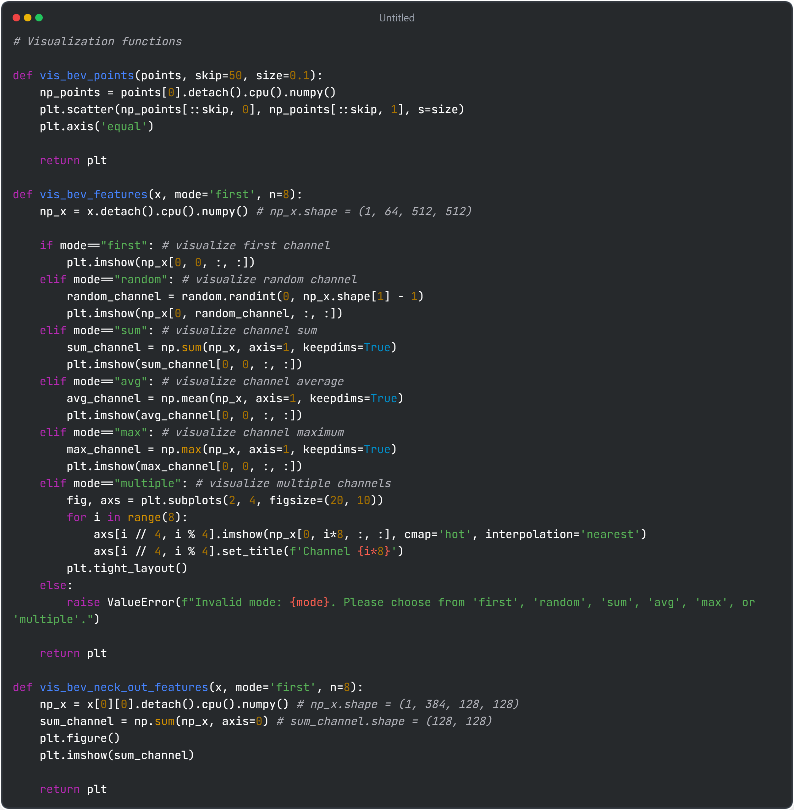
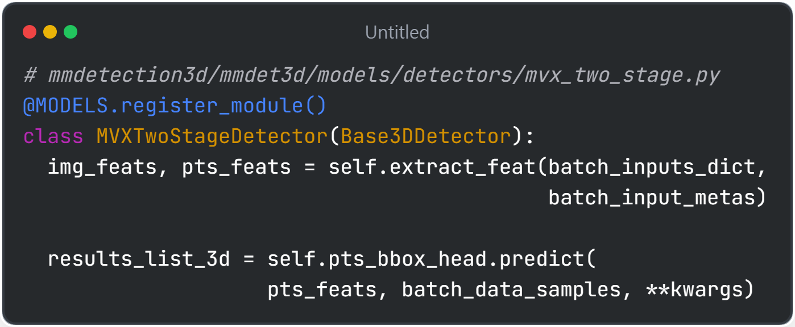
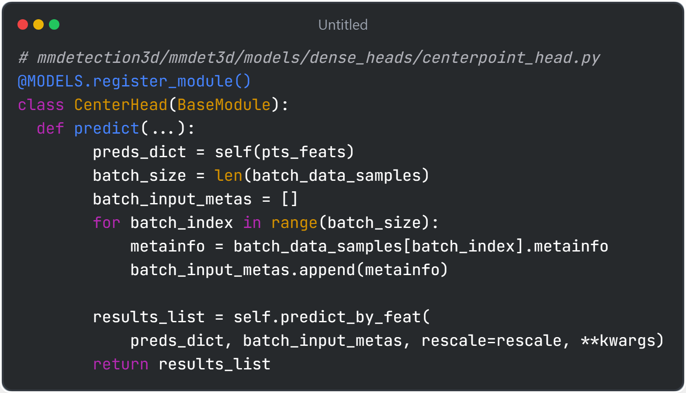
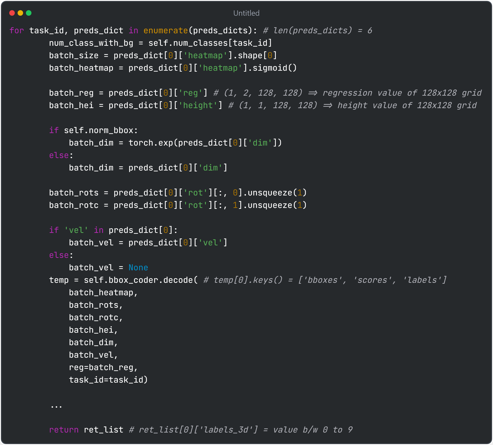

# Following CenterPoint through mmdetection3d

### Environment setting (using miniconda)

| Package/Library | Version |
|-------------------------------------------------|-------------------------|
| mmcv | 2.1.0 |
| mmdet | 3.2.0 |
| mmdet3d | 1.4.0 |
| mmengine | 0.10.5 |
| torch | 1.13.1+cu117 |
| conda cuda | 11.5 |

- NOTE1: All the pretrained weights and config files of supported models are @ https://github.com/open-mmlab/mmdetection3d/tree/main/configs/[modelname]
- NOTE2: Here we follow inference step using @ https://github.com/open-mmlab/mmdetection3d/tree/main/demo/pcd_demo.py, which is the inference file for point cloud 3d detection 

# Analyze config file
- Here we use, configs/centerpoint/centerpoint_pillar02_second_secfpn_head-circlenms_8xb4-cyclic-20e_nus-3d.py
    - File name analysis
        - pillar of voxel size 0.2m
        - second backbond, secondfpn beck
        - circle non-maximum suppression at the head
        - 8 GPUs, 4 batch size
        - cyclic learning rate scheduling
        - 20 epochs, pretrained on nuscenes dataset
    - config dependency 
        - centerpoint_pillar02_second_secfpn_head-circlenms_8xb4-cyclic-20e_nus-3d.py 
            - centerpoint_pillar02_second_secfpn_8xb4-cyclic-20e_nus-3d.py
                - ../_base_/datasets/nus-3d.py: base file for nuscenes dataset config
                - ../_base_/models/centerpoint_pillar02_second_secfpn_nus.py: base file for centerpoint model
                - ../_base_/schedules/cyclic-20e.py: base file for nuscenes cyclic scheduler for 20 epochs
                - ../_base_/default_runtime.py: base file of base file

## Following configs/_base_/models/centerpoint_pillar02_second_secfpn_nus.py
```python
voxel_size = [0.2, 0.2, 8] # Vocel size = 0.2m x 0.2m x 8m. Z-axis is large because using pillar
model = dict(
    type='CenterPoint', # Centerpoint model architectre
    data_preprocessor=dict( # Voxel preprocessing
        type='Det3DDataPreprocessor',
        voxel=True,
        voxel_layer=dict(
            max_num_points=20, # maximum points per voxel
            voxel_size=voxel_size,
            max_voxels=(30000, 40000))), # (train, inference)
    pts_voxel_encoder=dict( # extract featrue from voxel/pillar
        type='PillarFeatureNet', # simplified version of PointNet
        in_channels=5, # input feature channel per pillar
        feat_channels=[64], # output feature channel after passing MLP
        with_distance=False, # not using distance information as feature
        voxel_size=(0.2, 0.2, 8), 
        norm_cfg=dict(type='BN1d', eps=1e-3, momentum=0.01),
        legacy=False), # not using legacy code
    pts_middle_encoder=dict( # scatter pillar to 2d scene (512, 512, 64) feature
        # point_cloud_range = [-51.2, -51.2, -5.0, 51.2, 51.2, 3.0] defined at original config file [x_min, y_min, z_min, x_max, y_max, z_max]
        # channel size not changed here i.e. pts_voxel_encoder['feat_channels'] == pts_middle_encoder['in_channels'] and also out_channels
        type='PointPillarsScatter', in_channels=64, output_shape=(512, 512)), # number of grids = (51.2+51.2)/0.2 = 512 # point_cloud_range/voxel_size
        # returns (512, 512, 64)
    pts_backbone=dict( # extract feature for detection
        type='SECOND',
        in_channels=64,
        out_channels=[64, 128, 256], # multi-scale
        layer_nums=[3, 5, 5],
        layer_strides=[2, 2, 2], # 512 -> 256 -> 128 -> 64 # final output 64 x 64 x 256
        norm_cfg=dict(type='BN', eps=1e-3, momentum=0.01),
        conv_cfg=dict(type='Conv2d', bias=False)),
    pts_neck=dict( # output feature map of single scale
        type='SECONDFPN',
        in_channels=[64, 128, 256],
        out_channels=[128, 128, 128], # make channel size consistent 
        upsample_strides=[0.5, 1, 2], # 64 / 0.5 = 128, 128 / 1 = 128, 256 / 2 = 128
        norm_cfg=dict(type='BN', eps=1e-3, momentum=0.01),
        upsample_cfg=dict(type='deconv', bias=False),
        use_conv_for_no_stride=True),
    pts_bbox_head=dict(
        type='CenterHead', # detection head of CenterPoint
        in_channels=sum([128, 128, 128]), # pts_neck['out_channels'] == pts_bbox_head['in_channels']
        tasks=[ # define categories - 6 classes
            dict(num_class=1, class_names=['car']),
            dict(num_class=2, class_names=['truck', 'construction_vehicle']), # two types are grouped together into single category
            dict(num_class=2, class_names=['bus', 'trailer']),
            dict(num_class=1, class_names=['barrier']),
            dict(num_class=2, class_names=['motorcycle', 'bicycle']),
            dict(num_class=2, class_names=['pedestrian', 'traffic_cone']),
        ],
        common_heads=dict( # 5 parallel heads with shape (output size, # of layers) e.g. height (1, 2) = (single scalar output, 2 layers)
            reg=(2, 2), height=(1, 2), dim=(3, 2), rot=(2, 2), vel=(2, 2)),
        share_conv_channel=64,
        bbox_coder=dict( # decoding regression heads
            type='CenterPointBBoxCoder',
            post_center_range=[-61.2, -61.2, -10.0, 61.2, 61.2, 10.0],
            max_num=500,
            score_threshold=0.1,
            out_size_factor=4,
            voxel_size=voxel_size[:2],
            code_size=9),
        separate_head=dict(
            type='SeparateHead', init_bias=-2.19, final_kernel=3),
        loss_cls=dict(type='mmdet.GaussianFocalLoss', reduction='mean'), # Gaussian loss (higher weight close to center)
        loss_bbox=dict( # loss regression
            type='mmdet.L1Loss', reduction='mean', loss_weight=0.25),
        norm_bbox=True),
    # model training and testing settings
    train_cfg=dict(
        pts=dict(
            grid_size=[512, 512, 1],
            voxel_size=voxel_size,
            out_size_factor=4, # real scale factor
            dense_reg=1,
            gaussian_overlap=0.1,
            max_objs=500,
            min_radius=2,
            code_weights=[1.0, 1.0, 1.0, 1.0, 1.0, 1.0, 1.0, 1.0, 0.2, 0.2])),
    test_cfg=dict(
        pts=dict(
            post_center_limit_range=[-61.2, -61.2, -10.0, 61.2, 61.2, 10.0],
            max_per_img=500,
            max_pool_nms=False,
            min_radius=[4, 12, 10, 1, 0.85, 0.175],
            score_threshold=0.1,
            pc_range=[-51.2, -51.2],
            out_size_factor=4,
            voxel_size=voxel_size[:2],
            nms_type='rotate',
            pre_max_size=1000,
            post_max_size=83,
            nms_thr=0.2)))
```

## Following configs/centerpoint/centerpoint_pillar02_second_secfpn_8xb4-cyclic-20e_nus-3d (simplified)

```python
# Where this config file is derived from
_base_ = [
    '../_base_/datasets/nus-3d.py',
    '../_base_/models/centerpoint_pillar02_second_secfpn_nus.py',
    '../_base_/schedules/cyclic-20e.py', '../_base_/default_runtime.py'
]

point_cloud_range = [-51.2, -51.2, -5.0, 51.2, 51.2, 3.0]

class_names = [
    'car', 'truck', 'construction_vehicle', 'bus', 'trailer', 'barrier',
    'motorcycle', 'bicycle', 'pedestrian', 'traffic_cone'
]
data_prefix = dict(pts='samples/LIDAR_TOP', img='', sweeps='sweeps/LIDAR_TOP')
model = dict(
    data_preprocessor=dict(
        voxel_layer=dict(point_cloud_range=point_cloud_range)),
    pts_voxel_encoder=dict(point_cloud_range=point_cloud_range),
    pts_bbox_head=dict(bbox_coder=dict(pc_range=point_cloud_range[:2])),
    # model training and testing settings
    train_cfg=dict(pts=dict(point_cloud_range=point_cloud_range)),
    test_cfg=dict(pts=dict(pc_range=point_cloud_range[:2])))

dataset_type = 'NuScenesDataset'
data_root = 'data/nuscenes/'
backend_args = None

# Sampling dataset used for augmentation
db_sampler = dict(...)

# Pipeline to load and augment data for training
train_pipeline = [
    dict(
        type='LoadPointsFromFile',
        coord_type='LIDAR',
        load_dim=5, 
        use_dim=5,
        backend_args=backend_args),
    dict(
        type='LoadPointsFromMultiSweeps',
        sweeps_num=9, # use 9 sweeps
        use_dim=[0, 1, 2, 3, 4], # [x, y, z, reflectance, time]
        pad_empty_sweeps=True,
        remove_close=True,
        backend_args=backend_args),
    dict(type='LoadAnnotations3D', with_bbox_3d=True, with_label_3d=True),
    dict(type='ObjectSample', db_sampler=db_sampler),
    dict(
        type='GlobalRotScaleTrans', # augmentations
        rot_range=[-0.3925, 0.3925],
        scale_ratio_range=[0.95, 1.05],
        translation_std=[0, 0, 0]),
    dict(
        type='RandomFlip3D',
        sync_2d=False,
        flip_ratio_bev_horizontal=0.5,
        flip_ratio_bev_vertical=0.5),
    dict(type='PointsRangeFilter', point_cloud_range=point_cloud_range),
    dict(type='ObjectRangeFilter', point_cloud_range=point_cloud_range),
    dict(type='ObjectNameFilter', classes=class_names),
    dict(type='PointShuffle'),
    dict(
        type='Pack3DDetInputs',
        keys=['points', 'gt_bboxes_3d', 'gt_labels_3d'])
]
test_pipeline = [dict(...)]

# similar to pytorch dataloader
train_dataloader = dict(
    _delete_=True,
    batch_size=4,
    num_workers=4,
    persistent_workers=True,
    sampler=dict(type='DefaultSampler', shuffle=True),
    dataset=dict(
        type='CBGSDataset',
        dataset=dict(
            type=dataset_type,
            data_root=data_root,
            ann_file='nuscenes_infos_train.pkl',
            pipeline=train_pipeline,
            metainfo=dict(classes=class_names),
            test_mode=False,
            data_prefix=data_prefix,
            use_valid_flag=True,
            # we use box_type_3d='LiDAR' in kitti and nuscenes dataset
            # and box_type_3d='Depth' in sunrgbd and scannet dataset.
            box_type_3d='LiDAR',
            backend_args=backend_args)))
test_dataloader = dict(
    dataset=dict(pipeline=test_pipeline, metainfo=dict(classes=class_names)))
val_dataloader = dict(
    dataset=dict(pipeline=test_pipeline, metainfo=dict(classes=class_names)))

train_cfg = dict(val_interval=20)
```

# Running inference using mmdetection3d/demo/pcd_demo.py
| Code | Description |
|-------------------------------------------------|-------------------------|
|  | Calls mmdetection3d/mmdet3d/models/detectors/centerpoint.py |
|  | CenterPoint inherits MVXTwoStageDetector - which is model architecture that supports 3D detection with diverse sensor inputs |
|  | During inference, predict function is called<br>Main inner function: extract_feat()<br>Centerpoint only uses LiDAR for 3D detection. Thus, only pts_feats will return meaningful data i.e. img_feats are used for camera image inputs |
|  | Function where pts_feats are extracted from raw point clouds<br>The input voxels shape is (# of voxels, # of points in a voxel, point feature channel)<br>After passing 1. pts_voxel_encoder 2. pts_middle_encoder 3. pts_backbone 4. pts_neck, it returns the pts_feats of shape (batch size, feature dim, grid shape)|
|  | Current workflow: predict() -> extract_feat() -> extract_pts_feat()<br>1. vis_bev_points() visualize raw points clouds in bev (x-y plane)<br>2. pts_voxel_encoder() encode all points in a voxel in single representations<br>3. pts_middle_encoder() scatters voxel features in a 2d plane<br>4. vis_bev_features() visualize scattered features in bev. "multiple" option here can visualize random 8 channels<br>5. pts_backbone() extract multi-scal features for detection><br>6. pts_neck() merge multi-scale channels into single channel, and make consistent grid size<br>7. vis_bev_neck_out_features() visualize final features in bev<br>**NOTE: All visualization functions are not implemented in original code**|
|  | Visualization functions implementation |
|  | Back to predict function!<br>using pts_feats, pts_bbox_head.predict() outputs 3d detection results using centerpoint head<br>Centerpoint head is defined @ mmdetection3d/mmdet3d/models/dense_heads/centerpoint_head.py |
|  | CenterHead.predct() which preprocess data by batch then called predict_by_feat() |
|  | predict_by_feat() implementation<br>Each 6 different categories has 5 different heads (defined at config file)<br>Decoding step returns bouding boxes, scores, and labels<br>More detail of decoding step is @ mmdetection3d/mmdet3d/models/task_modules/coders/centerpoint_bbox_coders.py<br>returns bounding box with labels 0-9 |